# fetches
A curation of cool system information fetches.

# A

<a href="https://github.com/13-CF/afetch">13-CF/afetch</a>
- Simple system info written in C 

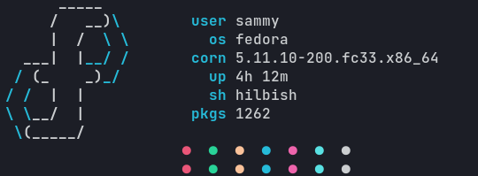

<a href="https://github.com/sticky-tea/afetch">sticky-tea/afetch</a>
- A command-line system information tool written in x86 assembly language 

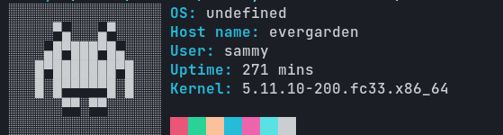

<a href="https://github.com/vyxxr/afetch">vyxxr/afetch</a>
- An alternative and POSIX system info for Unix-like operating systems based on ufetch 

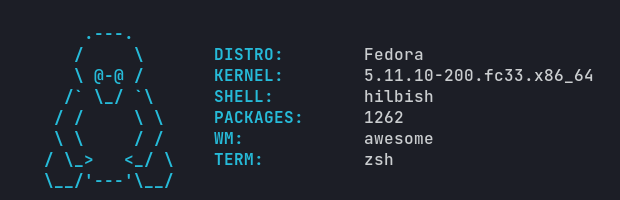

[archey4](https://github.com/HorlogeSkynet/archey4) - Archey is a simple system information tool written in Python

<a href="https://github.com/xxczaki/archfetch">archfetch</a>
- Simple CLI system information tool for Arch Linux.

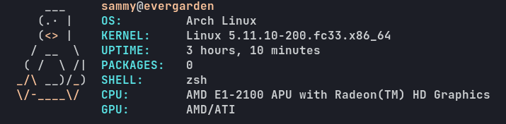

# B

<a href="https://gitlab.com/bit9tream/bitfetch">bitfetch</a>
- Simple fetch written in C.

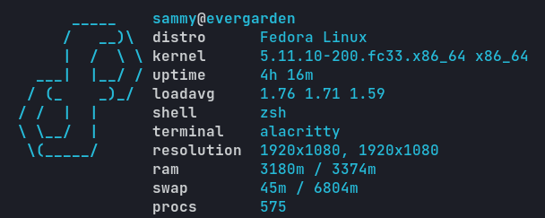

[Bunnyfetch](https://github.com/Luvella/Bunnyfetch) - Tiny system info fetch utility.  

<a href="https://github.com/Luvella/bunnyfetch.sh">bunnyfetch.sh</a>
- A small tool, just like a bunny, for information.

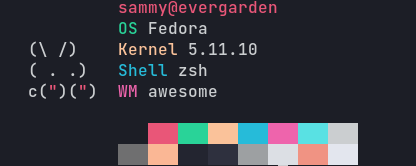

# C

<a href="https://github.com/Dr-Noob/cpufetch">cpufetch</a>
- Simple yet fancy CPU architecture fetching tool

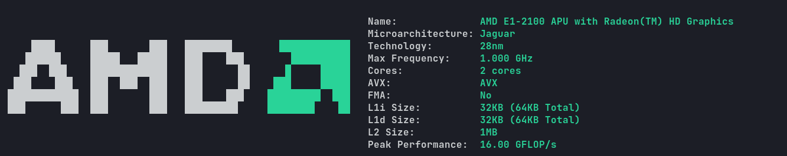

# F

<a href="https://github.com/irevenko/ferris-fetch">ferris-fetch</a>
- A system information tool for Rustaceans

<a href="https://github.com/6gk/fet.sh">fet.sh</a>
- a fetch written in posix shell without any external commands

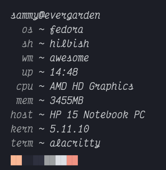

[freshfetch](https://github.com/K4rakara/freshfetch) - A fresh take on neofetch  

# J

<a href="https://github.com/Jimmysit0/jfetch">jfetch</a>
- A minimal Linux fetch script

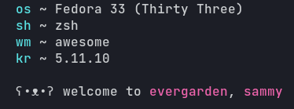

# M

<a href="https://github.com/depsterr/mfetch">mfetch</a>
- A minimal Linux fetch script

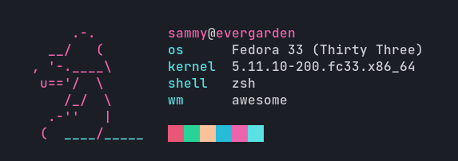

# N
[Neofetch](https://github.com/dylanaraps/neofetch) - A command-line system information tool written in bash 3.2+  
[NerdFetch](https://github.com/ThatOneCalculator/NerdFetch) - A POSIX \*nix fetch script using Nerdfonts  

# P
[pfetch](https://github.com/dylanaraps/pfetch) - A pretty system information tool written in POSIX sh.

<a href="https://github.com/charpointer/pridefetch">pridefetch</a>
- Neofetch clone written in Python with the ability to display pride flags

<i>no im not trans, the colors are really nice tho</i>
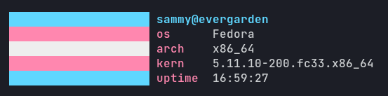

# R
[rsfetch](https://github.com/Phate6660/rsfetch) - Fast (~20ms execution time) and somewhat(?) minimal fetch program written in Rust.  
[rxfetch](https://github.com/Mangeshrex/rxfetch) - A Cute and Funny looking minimal fetch program in Bash. 

# S

<a href="https://github.com/KittyKatt/screenFetch">screenFetch</a>
- The Bash Screenshot Information Tool

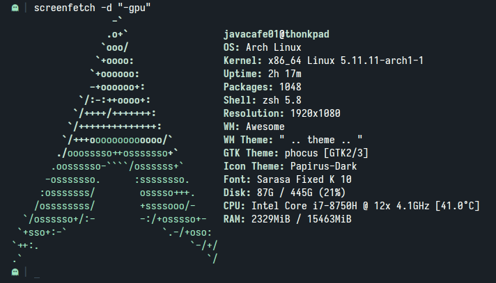

# U

<a href="https://gitlab.com/jschx/ufetch">ufetch</a>
- Tiny system info for Unix-like operating systems

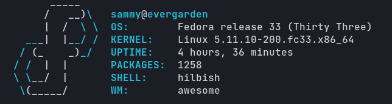

# W
[winfetch](https://github.com/lptstr/winfetch) - A command-line system information utility written in PowerShell. Like Neofetch, but for Windows.  

# Y

<a href="https://github.com/yrwq/yafetch">yafetch</a>
- Yafetch is a minimal command line system information tool written in C and configured in Lua.

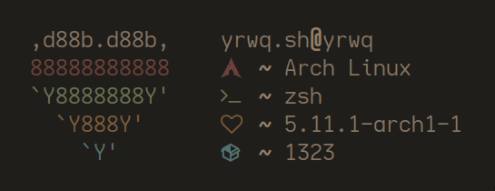

# Contribution
You can help grow this list! Just create a simple issue to
request a fetch (possibly yours) to be on this list.  

The only requirements are fairly easy and clear instructions on the
README, and to function properly (if not specific to an OS)
Or you can choose to PR it.  

You can also choose to add previews to fetches that don't have them.

# License

To the extent possible under law, [TorchedSammy](https://github.com/TorchedSammy) has waived all copyright and related or neighboring rights to this work.

See the [LICENSE](LICENSE) for more information.
